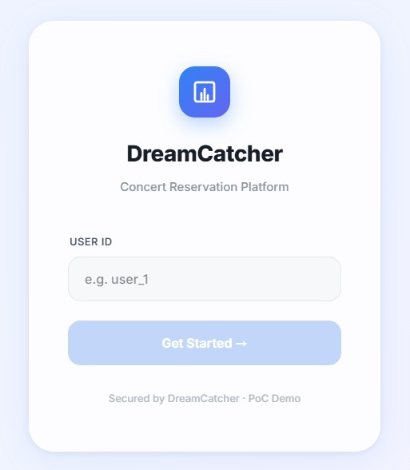
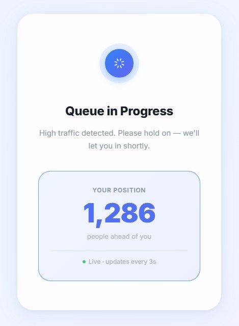
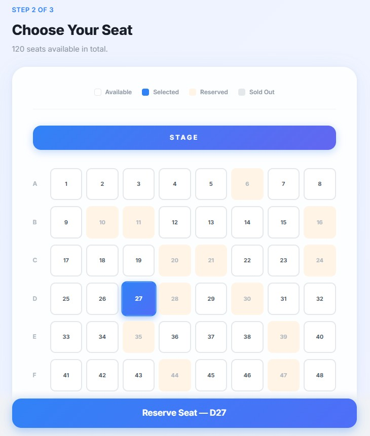

# 🎫 DreamCatcher (Frontend)

> **"기다림마저 설레는 경험, 프리미엄 콘서트 예매 플랫폼"**

DreamCatcher는 대규모 트래픽이 집중되는 콘서트 예매 환경에서 **안정적인 대기열 관리**와 **직관적인 좌석 선택 경험**을 제공하기 위해 설계된 프론트엔드 프로젝트입니다.

---

## 📸 Screenshots

### 1. 로그인 (Login)
- 사용자 식별을 위한 깔끔한 인터페이스


### 2. 실시간 대기열 (Waiting Room)
- 실시간 폴링을 통한 대기 순번 안내 및 인터랙티브 효과


### 3. 좌석 선택 (Seat Selection)
- 동적 그리드 기반의 프리미엄 좌석 선택 배치도


---

## 🏗️ Architecture: 관심사 분리 (SoC)

본 프로젝트는 유지보수성과 확장성을 극대화하기 위해 모든 페이지 컴포넌트를 세 가지 역할로 엄격히 분리하여 관리합니다.

- **Logic (`useHooks.ts`)**: API 호출, 상태 관리, 복잡한 비즈니스 로직을 담당하는 Custom Hook입니다.
- **View (`Page.tsx`)**: 오직 UI 구조와 레이아웃만을 담당하는 순수 JSX 영역입니다.
- **Style (`styles.ts`)**: 디자인 토큰과 테마를 관리하는 독립된 스타일 정의 파일입니다.

### 📂 Folder Structure
```text
src/
├── services/            # API 통신 로직
├── store/               # Zustand 전역 상태 관리
├── pages/               # 페이지 단위 컴포넌트
│   ├── Login/           # 로그인 (Logic/View/Style 분리)
│   ├── WaitingRoom/     # 대기열 (Logic/View/Style 분리)
│   ├── SeatSelection/   # 좌석 선택 (Logic/View/Style 분리)
│   └── Payment/         # 결제 (Logic/View/Style 분리)
├── index.css            # 전역 스타일 및 애니메이션
└── App.tsx              # 라우팅 설정
```

---

## 🚀 Key Features

### 1. 실시간 지능형 대기열 (Waiting Room)
- **실시간 순번 폴링**: 3초 주기의 폴링을 통해 사용자의 대기 위치를 실시간으로 업데이트합니다.
- **ACTIVE 상태 기반 제어**: 단순 순번이 아닌 서버의 활성화 상태(`ACTIVE`)를 감지하여 최적의 타이밍에 페이지를 전환합니다.
- **UX 최적화**: 순번 변화 시 시각적 피드백(Flashing 효과)과 비음수(Non-negative) 처리 로직을 통해 매끄러운 경험을 제공합니다.

### 2. 동적 좌석 선택 시스템 (Seat Selection)
- **무한 확장형 그리드**: 서버 데이터 개수에 맞춰 행(Row)과 열(Col)을 자동으로 생성하며, A-Z 형태의 행 라벨을 자동 부여합니다.
- **프리미엄 인터랙션**: 토스(Toss) 스타일의 `Light Blue` 호버 효과와 `cubic-bezier` 애니메이션을 적용하여 프리미엄 조작감을 구현했습니다.
- **데이터 정합성 보장**: 서버의 데이터 중복 이슈에 대비하여 클라이언트 사이드 인덱스 기반 매핑 로직을 탑재했습니다.

### 3. 예약 및 결제 flow
- **좌석 선점 시스템**: 선택한 좌석의 임시 예약(Locking)을 통해 동시성 문제를 방지합니다.
- **에러 핸들링**: 결제 시간 만료(403), 잔액 부족(409) 등 다양한 네트워크/비즈니스 예외 상황에 대한 사용자 안내 로직이 포함되어 있습니다.

---

## 🛠 Tech Stack

- **Framework**: `React 18`
- **Language**: `TypeScript` (VerbatimModuleSyntax 적용)
- **State**: `Zustand`
- **Build**: `Vite`
- **Style**: `Vanilla CSS` + `TailwindCSS`
- **API**: `Axios`

---

## 🏁 Getting Started

### Installation
```bash
npm install
```

### Development
```bash
npm run dev
```

---

## 💎 Design Philosophy

1. **Clean & Minimal**: 사용자 인지 부하를 줄이기 위한 미니멀한 디자인 지향
2. **Reactive Feedback**: 모든 동작에 대한 즉각적이고 부드러운 시각적 피드백 제공
3. **Robustness**: 데이터 불일치나 네트워크 오류 환경에서도 신뢰할 수 있는 정보를 제공하기 위한 방어적 프로그래밍 적용
